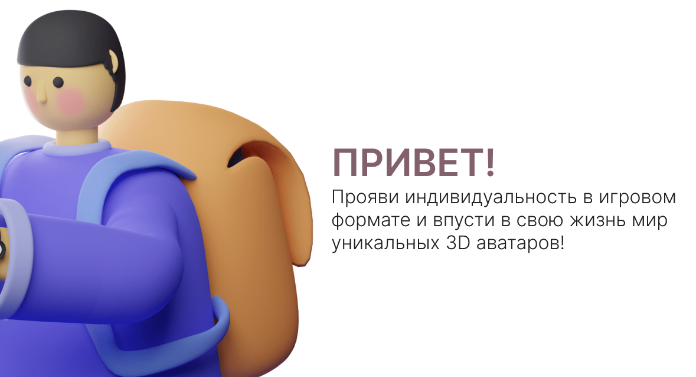
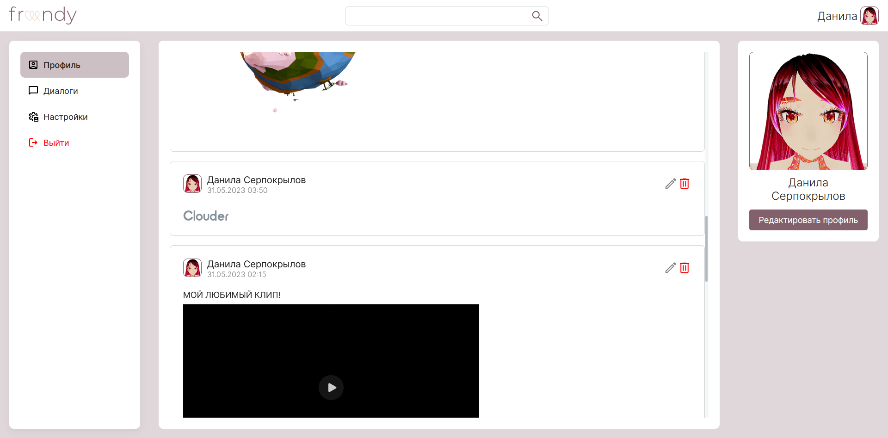

# frendy

A social network that is designed to be unique

Дипломная версия проекта закончена. Конечно в ней нет того, что мы изначально задумывали и планировали, но на данный момент в продакшн выльется версия для диплома, без некоторых фич и с неподчищенным кодом.

В реализации Frontend были использованы следующие технологии:
* React 18;
* useContext as State Management;
* WebSocket for online chat;
* three.js for 3D;
* Formik for forms;
* RTK Query for RESTApi communication;
* React-toastify as Toast Service;

BackEnd был реализован в свою очередь на Express + Mongo

Недочеты со стороны фронта, которые не хотелось бы допускать, будь у меня больше времени на реализацию фронтенд части: 
* хотелось бы выделять явно константы и компоненты, которые часто переиспользуются, и которые засоряют код самоповторением; 
* разделить большие блоки отдельных компонент на более мелкие, чтобы отделить логику, и не писать все в одном месте
